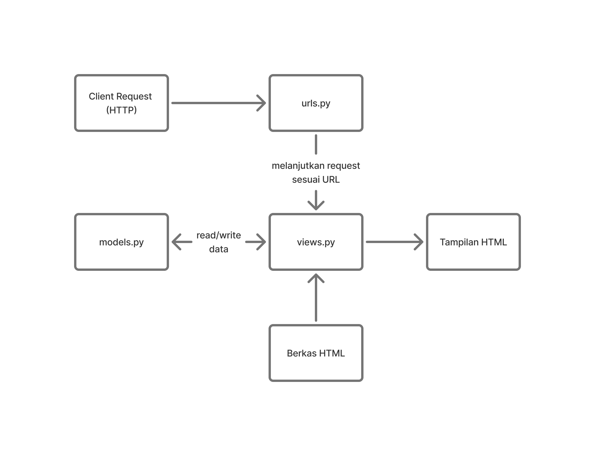
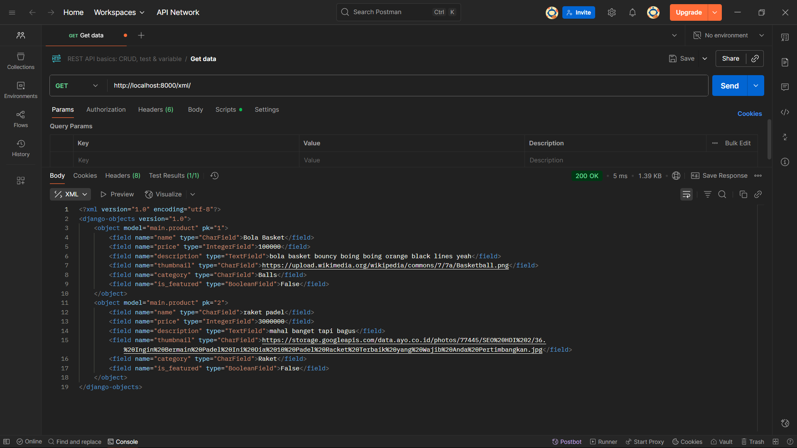
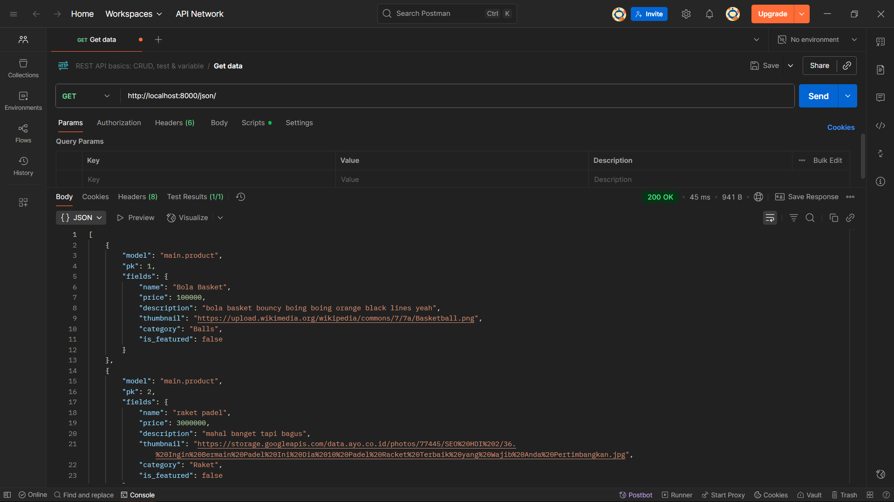
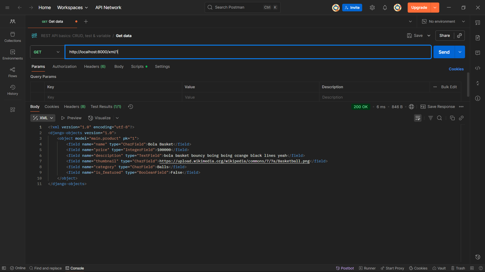
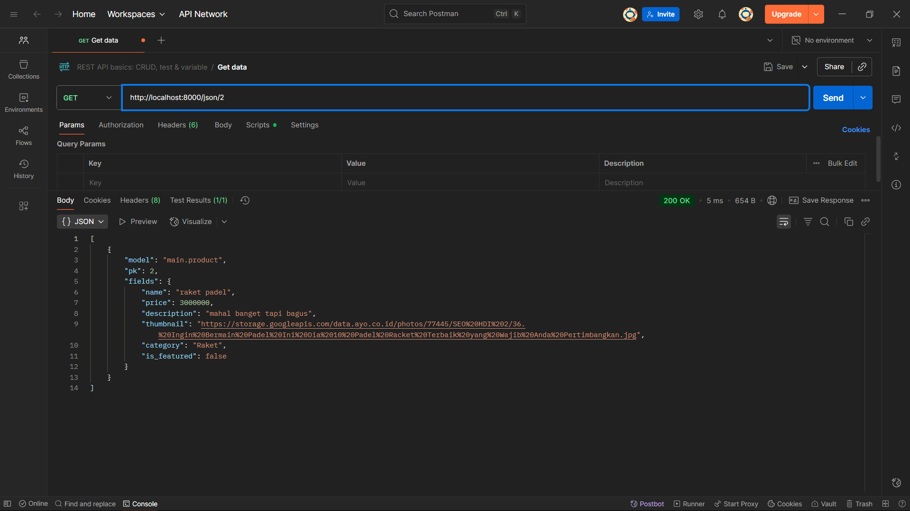

TUGAS 2

Jelaskan bagaimana cara kamu mengimplementasikan checklist di atas secara step-by-step (bukan hanya sekadar mengikuti tutorial).
Pertama, saya membuat repositori baru di GitHub dan direktori lokal untuk proyek baru ini. Kemudian, saya membuat dan mengaktifkan Virtual Environment sebelum membuat proyek Django dengan perintah startproject. Setelah itu, saya membuat file .env, .env.prod, dan modifikasi file settings.py mengikuti Tutorial 0. Sesudahnya, saya membuat aplikasi main dalam proyek tersebut dengan perintah startapp dan mendaftarkannya ke INSTALLED_APPS di settings.py. 
Untuk template, saya membuat direktori templates dalam aplikasi main lalu membuat berkas main.html yang berisi format tulisan nama dan kelas yang saya isi di views.py. Selain itu, saya mengimplementasi model dalam models.py untuk memiliki atribut yang disebutkan di soal. Terakhir, saya melakukan git add, commit, dan push, tidak lupa push ke pws juga.

Buatlah bagan yang berisi request client ke web aplikasi berbasis Django beserta responnya dan jelaskan pada bagan tersebut kaitan antara urls.py, views.py, models.py, dan berkas html.
urls.py meneruskan request client ke views.py yang sesuai. views.py menggabungkan template dari berkas html dengan data di models.py dan menampilkannya di laman web html.
<<<<<<< HEAD

=======

>>>>>>> b8580014b85fa9cb9a7e12b602df9f90f6e3f8ec

Jelaskan peran settings.py dalam proyek Django!
settings.py berperan sebagai konfigurasi proyek. Terdapat allowed_hosts untuk siapa yang bisa mengakses proyek, installed_apps untuk menghubungkan dengan aplikasi yang dibuat, dan lain sebagainya.

Bagaimana cara kerja migrasi database di Django?
Migrasi database di Django dilakukan dalam dua tahap, yaitu makemigrations untuk membuat migrasi dari perubahan sebagai persiapan lalu migrate untuk menerapkan perubahan tersebut ke dalam database Django lokal.

Menurut Anda, dari semua framework yang ada, mengapa framework Django dijadikan permulaan pembelajaran pengembangan perangkat lunak?
Menurut saya, Django cukup mudah untuk dipelajari dan digunakan, salah satunya karena menggunakan Python yang syntax-nya beginner friendly.
<<<<<<< HEAD

TUGAS 3

Jelaskan mengapa kita memerlukan data delivery dalam pengimplementasian sebuah platform?
Data delivery mengirim, menerima, dan mengintegrasikan data source ke data destination agar informasi bisa dibaca secara real-time dan konsisten.

Menurutmu, mana yang lebih baik antara XML dan JSON? Mengapa JSON lebih populer dibandingkan XML?
XML cocok untuk dokumen yang kompleks sehingga dianggap terlalu berat, JSON lebih simpel dan readable. JSON lebih populer karena dipakai ketika mementingkan kecepatan dan kemudahan pemakaian, serta mudah diintegrasikan dengan bahasa yang sering digunakan.

Jelaskan fungsi dari method is_valid() pada form Django dan mengapa kita membutuhkan method tersebut?
Method is_valid() mengecek apakah data yang diinput sesuai dengan aturan form, seperti tipe datanya, dll. Jika valid, is_valid() akan mengisi form.cleaned_data dan data siap diproses. Jika tidak valid, akan ke forms.errors. Kita membutuhkan method ini untuk memastikan data sesuai aturan dan aman untuk diproses.

Mengapa kita membutuhkan csrf_token saat membuat form di Django? Apa yang dapat terjadi jika kita tidak menambahkan csrf_token pada form Django? Bagaimana hal tersebut dapat dimanfaatkan oleh penyerang?
csrf_token memastikan hanya form asli yang memiliki token valid dan dicek di setiap request POST. Jika tidak digunakan, penyerang bisa membuat halaman palsu dengan hidden form, ketika diakses akan mengirim request ke server asli tanpa sepengetahuan pengguna sehingga data bisa diubah dan diretas.

Jelaskan bagaimana cara kamu mengimplementasikan checklist di atas secara step-by-step (bukan hanya sekadar mengikuti tutorial).
Saya membuat 2 function untuk xml dan json yang menerima parameter request dan masing-masing mengembalikan data xml dan json lalu 2 function lain xml dan json dengan parameter id untuk mengembalikan data per produk sesuai id. Kemudian, routing 4 function tersebut dengan import ke urls.py ke path yang sesuai. Setelah itu, membuat function add_product dan show_product di views.py yang akan redirect ke file add_product.html dan product_detail. Di main.html, saya menambahkan button "Add" dan "Detail" serta teks lainnya yang akan ditampilkan.

Postman

=======
>>>>>>> b8580014b85fa9cb9a7e12b602df9f90f6e3f8ec

TUGAS 4

Apa itu Django AuthenticationForm? Jelaskan juga kelebihan dan kekurangannya.
AuthenticationForm adalah form bawaan untuk me-login user yang menerima request sebagai argumen. Form ini termasuk field username dan password, validasi input user, mengecek apakah user aktif dengan confirm_login_allowed() dan akan menolak login jika is_active user False. Kelebihannya adalah metode yang efisien dan aman untuk login karena ada password hashing, error handling, dan tidak harus membuat form login dari awal. Kekurangannya adalah login hanya bisa dengan username dan password, jika ingin menggunakan field lain bisa dengan subclassing, serta tampilannya yang sangat simpel.

Apa perbedaan antara autentikasi dan otorisasi? Bagaiamana Django mengimplementasikan kedua konsep tersebut?
Autentikasi memeriksa identitas user sebelum memberi akses ke sistem, file, atau akun dengan membandingkan kredensial dengan database. Otorisasi memeriksa level akses user untuk memastikan user hanya bisa mengakses resource yang diperbolehkan sesuai rolenya. Contoh implementasi autentikasi adalah function authenticate, login, logout dari modul django.contrib.auth, sedangkan contoh implementasi otorisasi adalah function login_required dari modul django.contrib.auth.decorators.

Apa saja kelebihan dan kekurangan session dan cookies dalam konteks menyimpan state di aplikasi web?
Session menyimpan data di server sehingga lebih aman untuk informasi sensitif serta tidak memiliki limit data size, tetapi data hilang ketika session expire dan berjalan lebih lambat dibandingkan cookies. Cookies menyimpan data di browser user sehingga berjalan lebih cepat dan juga mengingat preferensi user, tetapi memiliki limit data size dan tidak seaman session. Cookies lebih sering digunakan untuk aplikasi web agar tidak harus login setiap kali mengakses website, seperti Google, Netflix, dsb. Session lebih cocok digunakan untuk aplikasi seperti banking, portal pemerintahan, dsb.

Apakah penggunaan cookies aman secara default dalam pengembangan web, atau apakah ada risiko potensial yang harus diwaspadai? Bagaimana Django menangani hal tersebut?
Penggunaan cookies tidak aman secara default, ada risiko cross site scripting (XSS), yaitu seorang user menyisipkan script di sisi client ke browser user lain. Hal ini bisa dicegah dengan memvalidasi input user sebelum dijalankan dengan is_valid. Selain itu, ada risiko cross site request forgery (CSRF), user meng-execute serangkaian actions menggunakan kredensial user lain tanpa sepengetahuan mereka. CSRF protection mengecek sebuah rahasia di setiap POST request yang spesifik ke user dengan menggunakan cookie sehingga user lain tidak bisa mengulang POST yang dilakukan. Lebih aman lagi jika web diakses melalui HTTPS daripada HTTP, set SESSION_COOKIE_SECURE dan CSRF_COOKIE_SECURE menjadi True.

Jelaskan bagaimana cara kamu mengimplementasikan checklist di atas secara step-by-step (bukan hanya sekadar mengikuti tutorial).
Membuat fungsi registrasi, login, dan logout di views lalu menyambungkan mereka dengan import di urls dan menambahkan path. Membuat file html register dan login di templates untuk menampilkan halaman register dan login di web. Menambahkan button logout di main.html yang tampil setelah user login. Mengimpor login_required di views dan mengaplikasikannya untuk fungsi show_main, add_product, dan show_product. Menggunakan cookies untuk mengambil data waktu login terakhir dengan method get di context fungsi show_main di views. Mengimpor kelas User dan menambahkan variabel user di models lalu melakukan migrasi. Mengubah fungsi add_product agar save terhubung dengan user yang sedang login. Aktivasi virtual environment, runserver, buka localhost. Membuat dua akun di halaman register dengan username dan password berbeda. Membuat 3 produk baru dengan mengisi semua variabel, logout, login akun kedua, membuat 3 produk lain.